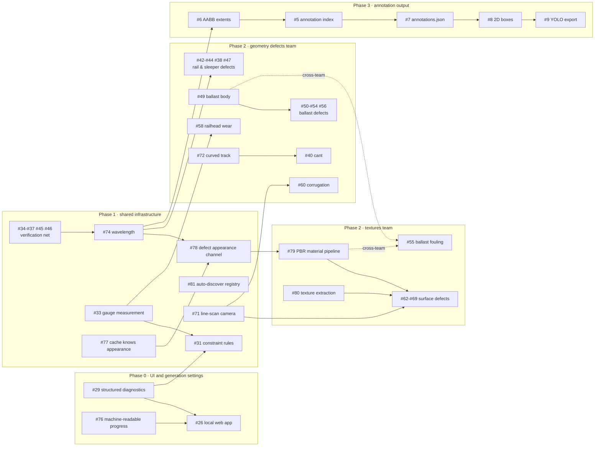

# Roadmap

What order the open work should be done in, and what can run at the same time.

This is an **ordering** document, not a schedule — there are no dates. It exists because the
issue tracker records *what* to do but not *what would be wasted by doing it too early*.
Milestones on GitHub mirror the phases below.

## The plan

Two teams working in parallel:

- **Textures team** — real photographs to Blender materials, then the defects that are made
  of texture.
- **Geometry defects team** — defects made of shape and position.

For that to work with minimal collision, two things happen first:

1. **Phase 0 — UI and generation settings.** Both teams need to render their own test videos.
2. **Phase 1 — Shared infrastructure.** Everything either team would otherwise change
   underneath the other.

Then the two run side by side, and the annotation chain runs beside both.

## What actually forces an order

Topic similarity is not dependency. Three things genuinely cause rework:

1. **Shared contracts.** `DefectVariant`, `ValidationIssue`, `PipelineSettings`, the `Defect`
   base class. Anything built on one before it settles gets rewritten.
2. **Shared files.** Two people editing `defects/base.py` collide however unrelated their
   subjects are.
3. **Semantics about to change.** Writing a rule against a quantity already scheduled to move.

One consequence inverts the obvious order: **verification comes before refactoring.** #74
claims to be a pure refactor leaving existing defects rendering identically. That claim is
only checkable if the tests proving current behaviour already exist — so #34-#37, #45 and #46
are what make #74 safe, not follow-up tidying.

## Dependency graph

## Phase 0 — UI and generation settings

Ahead of both teams, because both need to render test videos without recalling a
`blender --background` invocation and picking from 24 shell scripts.

**#75 (units) is done** — speed is stated in km/h, track length derives from speed and
duration, and frame rate no longer changes how fast the train moves. That releases the
form's field list for #26 and settles the quantities #29 has to serialise.

| | |
|---|---|
| **#29** structured diagnostics | machine-readable validation, so a form can highlight a field |
| **#76** machine-readable progress and cancellation | `app/progress/` drives a terminal tqdm bar a browser cannot consume |
| **#26** local web app | thin Python backend, hand-written HTML/CSS/JS front end |

Nothing here touches either team's files.

## Phase 1 — Shared infrastructure

Everything both teams build on. Each item changes a contract or a file the two teams would
otherwise edit from opposite sides.

**The regression net** — #34, #35, #36, #37, #45, #46. Proves what the existing defects do,
which is what makes the refactors below safe.

**Contract changes** — must be settled before anyone builds on them:

| | Why shared |
|---|---|
| **#74** wavelength as a first-class parameter | changes `DefectVariant` and `defects/base.py`; both teams declare variants |
| **#78** appearance channel in the `Defect` contract | changes `defects/base.py`; the textures team needs it to exist, the geometry team subclasses around it |
| **#77** section cache accounts for appearance | moves the boundary between `track_section.py` and `app/materials/` — the exact seam both teams would edit |
| **#33** gauge to inner-face measurement | config semantics read by both |

**Friction reducers and shared capabilities** — #81 auto-discover registry (removes the one
file every new defect touches), #71 line-scan camera (makes fine defects resolvable for both
#60 and Group E), #31 constraint rules, #22 policy, #12 and #13 camera decisions.

## Phase 2 — the two teams

### Textures team

Owns `app/materials/`, `app/config/appearance.py`, and the surface-defect packages.

**#79** PBR material pipeline → **#80** texture extraction → **#62-#69** surface defects,
plus **#55** ballast fouling.

Note **#80 is not a blocker for #62-#69**. Modelling a textural defect needs the material
pipeline and the appearance channel, not the extraction library. Keeping extraction off that
path means the defect work is not hostage to the ML-heavy piece.

### Geometry defects team

Owns the geometric defect packages, `track_section.py` and `app/config/geometry.py`.

**#42-#44, #38, #47** rail and sleeper defects → **#49** ballast body → **#50-#54, #56**
ballast defects; alongside **#58** railhead wear, **#59**, **#60**, and **#72** curved track →
**#40** cant, plus **#73** rail inclination.

### Where the two touch

Deliberately almost nowhere. The remaining contact points:

- **`registry.py`** — both add entries. That is what #81 removes.
- **#55 ballast fouling** — the one genuinely cross-team item: it needs the geometry team's
  ballast body (#49) *and* the textures team's material pipeline (#79). Schedule it late and
  give it an owner explicitly.
- **`defects/base.py`** — frozen in Phase 1 precisely so neither team has to reopen it.

## Phase 3 — Annotation output

#6 → #5 → #7 → #8 → #9/#10, plus #11. Independent of the team split and gated only on #74,
because #6 and #74 both touch the defective cache.

This is the **critical path to a trainable dataset**. Everything else has slack.

## Not scheduled

Umbrella tasks (#4, #14, #32, #41, #48, #57, #61) span phases and carry no milestone; their
subtasks do. **#23** solver, **#24** backend review and **#83** runtime-script rework are
backlog — deliberately unscheduled rather than forgotten. #83 in particular waits on #26:
reworking the scripts before the CLI and the UI have settled means doing it twice.

## Keeping this honest

**This file is updated whenever issues change — opened, closed, or edited — in the same pass
as the change itself.** Not afterwards, and not only when an ordering assumption moves.

- **Opened** — place it in a phase, give it the matching milestone, and add it to the graph if
  anything depends on it or it depends on anything.
- **Closed** — take it out of the graph and its phase, then check what it was blocking: a
  closed dependency usually releases something.
- **Edited** — if scope or dependencies changed, phase placement and graph edges change too.
- **Consolidated or superseded** — no dangling references to issue numbers that no longer mean
  anything.

The "Not scheduled" list and the GitHub milestones are part of this: all three have to agree,
and they have drifted apart before.

The reason for the strictness is that a stale dependency graph is worse than no graph. The
point of this file is to say what would be *wasted* by starting something too early, and a
reader who cannot trust it either ignores it or is misled by it. Both are worse than the
maintenance cost.
