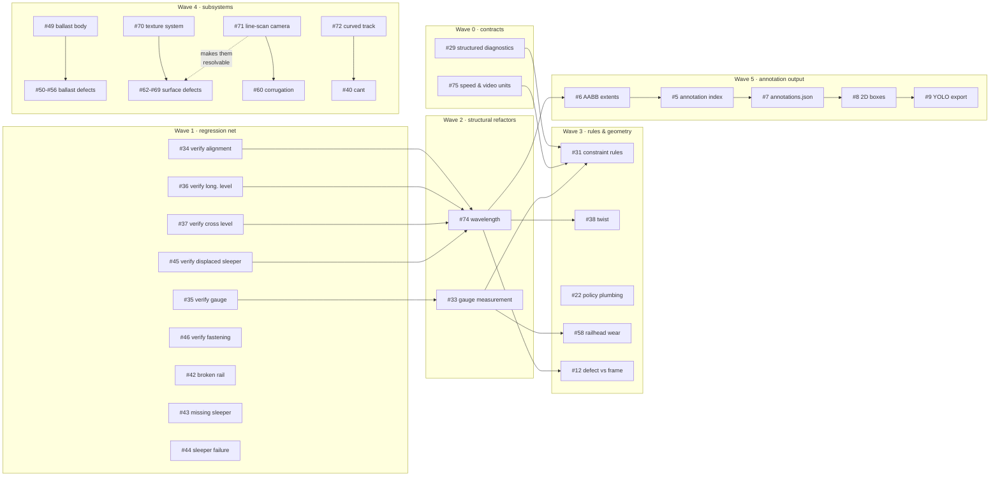

# Roadmap

What order the open work should be done in, and what can run at the same time.

This is an **ordering** document, not a schedule — there are no dates. It exists because
the issue tracker records *what* to do but not *what would be wasted by doing it too
early*. Milestones named after the waves below mirror this on GitHub.

## What actually forces an order

Topic similarity is not dependency. Three things genuinely cause rework:

1. **Shared contracts.** `DefectVariant`, `ValidationIssue`, `PipelineSettings`. Anything
   built on one of these before it changes shape gets rewritten.
2. **Shared files.** Two pieces of work editing `defects/base.py` collide however
   unrelated their subjects are.
3. **Semantics about to change.** Writing a rule against a quantity whose definition is
   already scheduled to move.

One consequence is worth stating plainly, because it inverts the obvious order:
**the verification work comes before the refactors.** #74 claims to be a pure refactor
that leaves existing defects rendering identically. That claim is only checkable if the
tests proving current behaviour already exist — so #34-#37, #45 and #46 are the net that
makes #74 safe, not follow-up tidying.

## Dependency graph

## The waves

### Wave 0 — Contracts
Small, root-level, and read by everything downstream. Do them first and alone.

| | Why first |
|---|---|
| **#75** speed and video units | touches `PipelineSettings`, `RenderConfig`, `config.py` and every runtime script |
| **#29** structured diagnostics | changes `ValidationIssue`; every rule written afterwards uses the new shape |

They touch different files, so they can run concurrently with each other.

### Wave 1 — Regression net
The safety net for Wave 2, plus the defects that need no new machinery. Each item owns a
different module and its own test file, so this wave parallelises almost perfectly.

Verification: **#34** alignment, **#35** gauge, **#36** longitudinal level,
**#37** cross level, **#45** displaced sleeper, **#46** fastening.

New defects: **#42** broken rail, **#43** missing sleeper, **#44** complete sleeper failure.

**#35 before #33** — establish what gauge defects currently do before changing what gauge
means.

### Wave 2 — Structural refactors
Each touches a shared contract, so each wants the tree to itself. They are independent of
one another.

| | Touches |
|---|---|
| **#74** wavelength as a first-class parameter | `DefectVariant`, `defects/base.py`, `_bend_mesh`, defective cache |
| **#33** gauge to inner-face measurement | `TrackGeometryConfig`, validation |

### Wave 3 — Rules and geometry defects
Everything here needs a Wave 0 or Wave 2 contract to be final first.

**#31** constraint rules · **#38** twist · **#22** policy plumbing · **#58** railhead wear ·
**#12** defect-versus-frame decision · **#13** frame overlap · **#47** bent sleeper

### Wave 4 — New subsystems
Four independent capabilities, each unlocking its own defect group. Mutually parallel.

| Capability | Unlocks |
|---|---|
| **#49** ballast body | #50-#56 |
| **#70** texture system | #62-#69, and #55 |
| **#71** line-scan camera | #60, and makes #62-#69 resolvable targets at all |
| **#72** curved track | #40 cant |

Also here: **#59** plastic flow, **#73** rail inclination.

### Wave 5 — Annotation output
A chain, and the **critical path** of the whole project: #6 → #5 → #7 → #8 → #9/#10,
plus **#11** dataset render mode.

Largely independent of defect modelling, with one coupling: **#6 and #74 both touch the
defective cache**, so #6 waits on #74. That single edge is the main link between the two
halves of the project.

## Parallel tracks

Three streams that barely share files:

| Track | Owns | Sequence |
|---|---|---|
| **Defect geometry** | `app/geometry/defects/` | verify → #74 → #38 → #42-#44 |
| **Config and validation** | `app/config/`, `app/validation/` | #75, #29 → #33 → #31 → #22 |
| **Subsystems** | `track_section.py`, `app/materials/`, `app/camera/` | #49 / #70 / #71 / #72 |

The annotation chain is a fourth stream, gated only on #74.

**Critical path:** verify → #74 → #6 → #5 → #7 → #8 → #9. Seven serial steps, and the
route to a trainable dataset. Everything else has slack — if output matters sooner, staff
this chain first.

## Not scheduled

Umbrella tasks (#4, #14, #32, #41, #48, #57, #61) span several waves and carry no
milestone; their subtasks do. **#23** solver, **#24** backend review and **#26** UI are
backlog — deliberately unscheduled rather than forgotten.

## Keeping this honest

Update it when an ordering assumption changes, not when an issue closes — GitHub already
tracks completion. The graph is worth changing only if a *dependency* turns out to be
wrong, which is the interesting kind of surprise.
